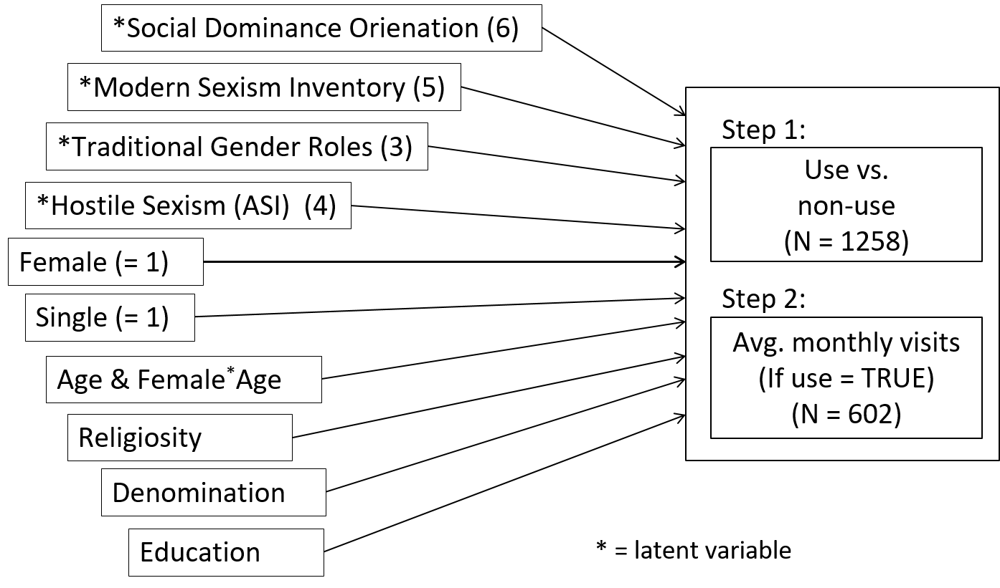
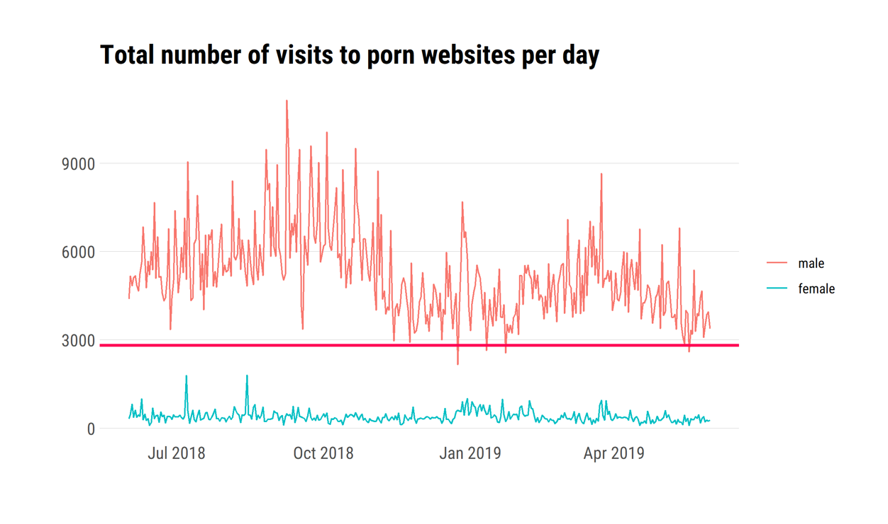
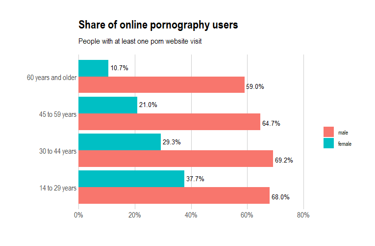
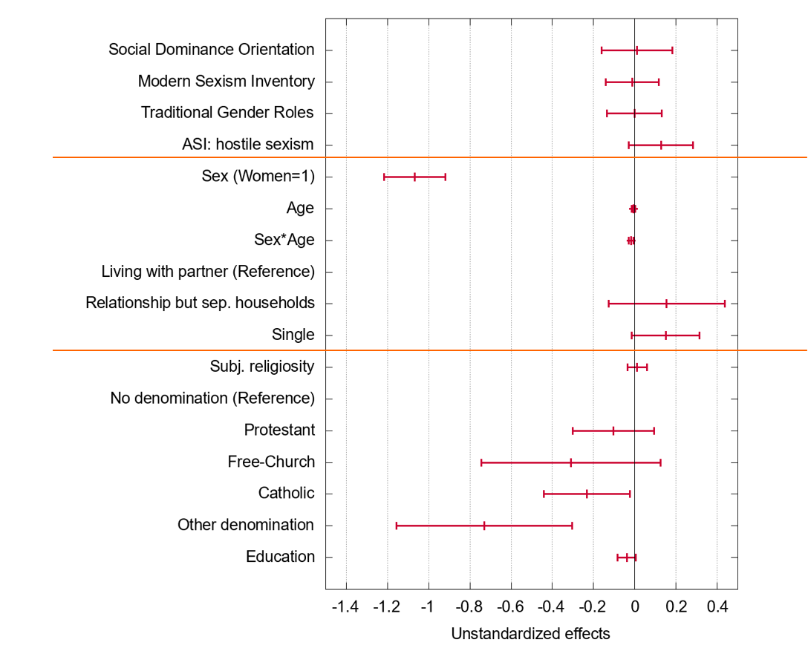
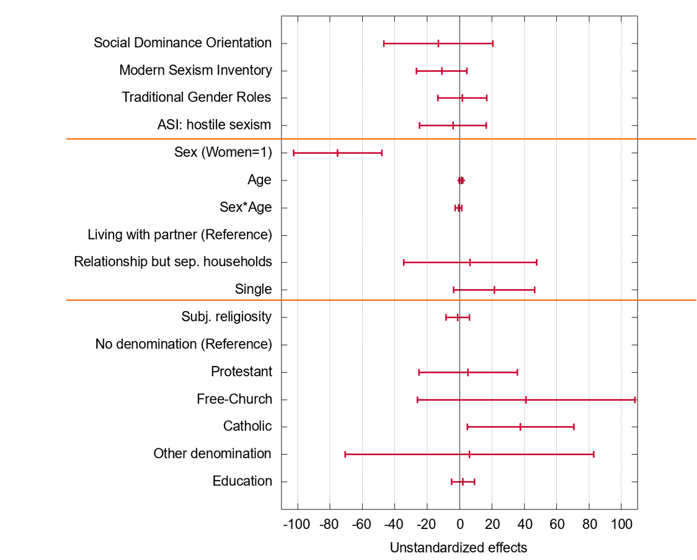

```{r, include=FALSE}
knitr::opts_chunk$set(echo = FALSE,
                      warning = FALSE,
                      tidy = FALSE,
                      message = FALSE,
                      fig.align = 'center',
                      out.width = "100%")
options(knitr.table.format = "html") 
```

# Introduction

While pornography has been studied much less compared to other types of media/content [@GrubbsKraus2021], quite a few studies have looked at antecedents and differences in its use [@GrubbsEtAl2019]. These studies have, e.g., found that (young) men are the heaviest users of pornography, and that religious men tend to consume more pornography than nonreligious men, whereas religious women seem to only very rarely consume it [@ShortEtAl2015]. While these findings are in line with commonly held assumptions, others are more counterintuitive. For example, a study by @KohutEtAl2016 has shown that frequent porn users show more gender-egalitarian attitudes. Notably, the robustness of most previous findings can be questioned to a certain degree as these are based on self-report data, which are very prone to social desirability bias in pornography research [@RegnerusEtAl2016]. Hence, the use of tracking data has been suggested as a promising methodological approach [@GrubbsKraus2021].

# Research Questions

**_RQ 1_**: Is the sex gap in online pornography use known from self-report studies also visible in web tracking data?

**_RQ 2_**: Can the sex gap in online pornography use be explained by different attitudes regarding gender roles, different religious profiles, or other differences in sociodemographic attributes?

# Methods

Our data come from a (non-probability) web tracking panel with ~ 2,000 participants per month, spanning the period from June 2018 to May 2019. Participants used software that tracks their website visits on the domain level (e.g., youporn.com). We combined these web tracking data with survey data. *N* = 1,323 of the panelists (48.15% female, mean age = 45.21) completed an online questionnaire in which we asked for basic sociodemographics and a set of attitudes and personality traits, including sexism, gender role attitudes, religiosity, and social dominance orientation.

```{r, models, out.width="90%"}

```

# Results

```{r, sex-time}

```

```{r, age-sex}

```

### Use vs. non-use

```{r, coeff-dic}

```

### Frequency of use

```{r, coeff-freq}

```

# Discussion

Our study illustrates that web tracking data are a promising tool for studying online pornography use. They allow for more fine-grained analyses of usage patterns and avoid the issues associated with sensitive questions in surveys. On the substantive side, our finding that sex, age, and religiosity were the strongest predictors of online pornography use confirm results from earlier survey studies [@MartyniukDekker2018;@PriceEtAl2016]. Notably, while using web tracking data in combination with survey data provides a number of advantages compared to only using self-report data, our study had a number of limitations that need to be considered when interpreting its results. The data come from a non-probability sample in which users opt in to having their internet use tracked. This sample is, of course, not representative for the German population (or even the population of German internet users). In addition, participants were able to pause the tracking, and the tracking data are only on the domain level, meaning that we cannot really distinguish between different types of pornographic content.


# References
